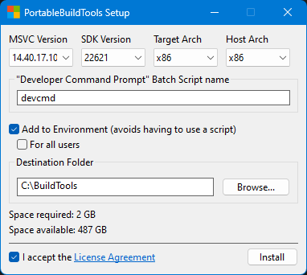

# vsQuake

This is a copy of WinQuake, that has been tweak to easily build and run it in VS Code.

## Installing build tools

Download and run the latest release of [PortableBuildTools](https://github.com/Data-Oriented-House/PortableBuildTools?tab=readme-ov-file).

Configure the appropriate settings and run Install.
> NOTE: Quake runs on x86. Therefore you MUST set the `Target arch` and `Host Arch` to x86.
> These are the settings I used
>
> 

Restart your computer to make sure environment variables are properly picked up.

You should now be able to build, run and debug `vsQuake` using VS Code.

## How to build

In VS Code, you can use the key combination `Ctrl+Shift+B` to run the build task.

Alternatively, you can run the `vsbuild.bat` script directly in a terminal of your choice.

> Note: The build script will try to copy in the `id1` folder from your purchased copy of quake, such that the build can be run straight from the output folder. The script currently assumes you've purchased the game through Steam, and tries to get the resources from a commonly used path. You may need to change this path on your system. To do so, find the line that starts with `set id1=` in the `vsbuild.bat` script, and change the path to the `id1` folder of your purchased copy of Quake.

## How to run

To run the build, simply run the `vsrun.bat` file, or navigate to the `bin` folder and run `quake.exe`.

## How to debug

Simply put a breakpoint in a file (a good starting point is somewhere in the `WinMain` function in `sys_win.c`), and press F5.

## References

- [Dani Crunch on YouTube - How to setup C on Windows](https://www.youtube.com/watch?v=SRkD9TOIlCM)